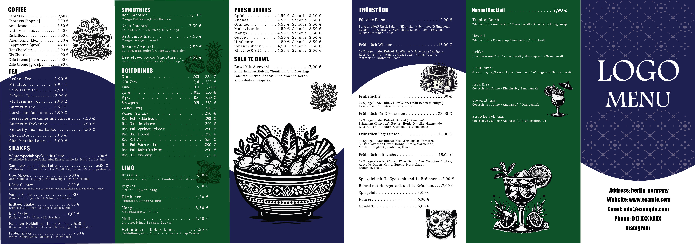

# Restaurant Menu Design — Germany

 

## About the Project

A professional menu design project created for a restaurant in Germany.

The project includes two separate menu designs, developed with a focus on visual hierarchy, readability, typography, layout, and an elegant presentation suitable for a restaurant environment.

## Menu Designs

### Menu 01

### Menu 02

## Design Features

* Clean and modern layout
* Professional typography
* Clear visual hierarchy
* Restaurant-focused design
* Consistent spacing and alignment
* Print-ready design approach
* Suitable for both print and digital presentation

## Tools & Software

* Adobe Illustrator
* Adobe InDesign

## Project Details

| Category        | Details                           |
| --------------- | --------------------------------- |
| Project Type    | Restaurant Menu Design            |
| Number of Menus | 2                                 |
| Location        | Germany                           |
| Design Software | Adobe Illustrator, Adobe InDesign |
| Purpose         | Restaurant Menu                   |
| Format          | Print & Digital                   |

## Design Process

1. Understanding the restaurant's visual requirements
2. Planning the menu structure and layout
3. Selecting typography and visual elements
4. Designing the menu pages
5. Refining spacing, alignment, and hierarchy
6. Preparing the final designs for presentation

## Project Preview

The images above provide a visual overview of the two menu designs created for the restaurant.

## Author

**Meysam**

Graphic Designer & Web Developer

---

*This project was created as a professional design portfolio piece.*
